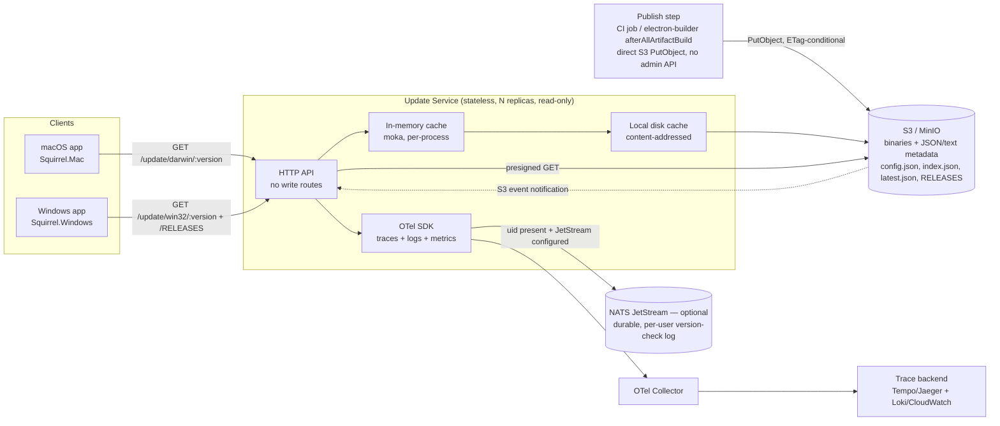

# Self-Hosted Electron Update Server — Architecture Analysis & Design

**Scope:** a backend compatible with Electron's native `autoUpdater` module (Squirrel.Mac on macOS, Squirrel.Windows on Windows), backed by S3-compatible object storage (AWS S3 or MinIO), with an in-memory + local-disk caching tier in front of it, and OpenTelemetry-based tracing plus structured, user-attributable logging of every version check.

## 1. Prior art

Four sources were reviewed to ground the design in the protocol Electron actually speaks and in the trade-offs existing self-hosted servers have already made.

**Electron's own docs** describe the contract, not an implementation. The app calls `autoUpdater.setFeedURL({ url })` and then `checkForUpdates()`; Electron itself issues the HTTP requests. On macOS it hits the feed URL directly and expects either `204 No Content` (no update) or a JSON body with a mandatory `url` (a `.zip`) and optional `name`, `notes`, `pub_date`. On Windows, Squirrel.Windows expects a feed shaped like `GET /update/{platform}/{version}` whose `/RELEASES` sub-resource returns lines of `{SHA1} {nupkg-url} {size}`; Squirrel does its own version comparison against that manifest rather than the server deciding up front. This is the actual wire protocol every server below has to reproduce — everything else (channels, flavors, rollouts, storage) is a design choice layered on top of it.

**electron-release-server** (Sails.js/Waterline, disk or S3 for assets, any Waterline-supported DB for metadata) is the most direct implementation of that contract. Its update route is `/update/:platform/:version[/:channel]`, with a parallel `/update/flavor/:flavor/:platform/:version[/:channel]` for apps that ship multiple build variants (e.g. different feature flags or white-labeled builds) from one server. Downloads are served from separate `/download/...` routes keyed by version, platform, channel, or flavor, decoupled from the update-check routes. It has an admin UI and LDAP auth, but no caching layer of its own — it leans on the DB and disk/S3 for every request, and returns a plain `404` for anything not uploaded.

**Nucleus** (Atlassian) is the closest existing analog to what's being asked for here: static-file storage (S3, optionally fronted by CloudFront) with a small metadata service on top, organized as apps → channels → versions, with staged/percentage rollouts on macOS and Windows and "latest" static download URLs. It deliberately avoids a heavyweight runtime — the pitch is "one command to run." Its logging story is thin (a `DEBUG=nucleus*` flag), which is precisely the gap this design closes.

**Nuts** (GitbookIO) is the outlier: it has no storage of its own at all — GitHub Releases *is* its backing store, and it stays stateless by relying on GitHub webhooks to know when new releases exist rather than polling or caching. Its macOS endpoint (`/update?version=&platform=`) and download-resolution logic (picking `.zip` for Mac, `.nupkg` for Windows, `.dmg` for humans, off of one release's assets) is a useful reference for how to do *platform/arch → asset* resolution without hardcoding filenames, but its "middleware for injecting analytics" framing is exactly the seam this design fills in properly instead of leaving as an exercise for the operator.

The synthesis: reuse electron-release-server's route shape (`/update/:platform/:version[/:channel]`, `/download/...`) since it's the most literal mapping onto the Squirrel contract and is what most self-hosters expect; adopt Nucleus's storage philosophy (S3/MinIO as the source of truth, no assets on local disk); adopt Nuts's asset-resolution-by-metadata approach rather than encoding logic in filenames; and add the two things none of the three do well — a real caching tier with explicit invalidation, and first-class tracing/logging with a user-id dimension.

## 2. High-level architecture



The API tier is stateless, horizontally scalable, and **entirely read-only** — it has no write endpoints and no database. All durable state, including metadata that would traditionally live in a relational database (apps, channels, release history, rollout percentages), lives in S3/MinIO as plain JSON/text objects. Publishing happens out-of-band, directly against the bucket, from whatever tool already produces the build (CI, or a small script invoked from electron-builder's publish hook). Each replica keeps its own L1/L2 cache; because the only source of truth is S3, cache correctness only ever depends on invalidation from S3 events plus a TTL backstop, never on coordinating with a database.

Within a single container, "each replica" is itself further split into one shard per allocated CPU rather than one shared thread pool — a shared-nothing, thread-per-core layout (own listening socket via `SO_REUSEPORT`, own cache copy, own reactor) that removes cross-core lock/atomic contention from the request path entirely. §9 covers the reasoning and the epoll/io_uring reactor choice in detail; it's called out here because it changes what "one replica" means structurally, not just an implementation detail buried later.

## 3. Data model — as S3 objects, not a database

There is no database. Every piece of metadata that a relational schema would normally hold is instead a small, cacheable JSON (or plain-text) object in the same bucket as the binaries, so the read path is uniformly "GET an object, maybe from cache" with nothing else to stand up or migrate:

```
{app}/config.json                                   -- { "channels": ["stable","beta"], "defaultChannel": "stable" }
{app}/{channel}/{platform}/{arch}/index.json         -- full version history for this combo:
                                                          [{ version, notes, pub_date, rollout_pct,
                                                             assets: [{ kind, filename, sha1, sha512, size_bytes }] }, ...]
{app}/{channel}/{platform}/{arch}/latest.json        -- precomputed Squirrel.Mac manifest (derived from index.json)
{app}/{channel}/{platform}/{arch}/RELEASES           -- precomputed Squirrel.Windows manifest (derived from index.json)
{app}/{channel}/{platform}/{arch}/{version}/{filename} -- raw asset bytes (zip, nupkg, dmg, exe)
```

`index.json` is the append-only system of record for a given app/channel/platform/arch; `latest.json` and `RELEASES` are pure derivations of it, recomputed and rewritten together whenever `index.json` changes (§10). `rollout_pct` lives on each entry in `index.json` and is copied into `latest.json` — it's the Nucleus-style staged-rollout knob: a request is eligible for a release once a deterministic hash of `(app, channel, client_identifier)` falls under the threshold, so the same client consistently lands on the same side of the rollout instead of flapping between old and new on every check. `kind` on each asset distinguishes what Squirrel needs per platform (`zip` for macOS, `nupkg` for Windows) from human-facing installers (`dmg`/`exe`) served from the same `/download` routes.

## 4. Storage layer (S3 / MinIO)

Building on §3's layout, every object a request might need — binary or metadata — lives under one deterministic key, so resolving a request never requires anything beyond a `HeadObject`/`GetObject` call:

```
s3://updates/
  {app}/config.json
  {app}/{channel}/{platform}/{arch}/index.json
  {app}/{channel}/{platform}/{arch}/latest.json
  {app}/{channel}/{platform}/{arch}/RELEASES
  {app}/{channel}/{platform}/{arch}/{version}/{filename}
```

`latest.json` and `RELEASES` are recomputed by the publish step whenever `index.json` changes, not computed per-request. That keeps the read path a plain object fetch instead of a query-and-render, and it's what makes the caching tier in the next section effective — these are the objects requested on every single update check, from every installed copy of the app, and they change at most a few times a day. Writes to `index.json` use conditional `PutObject` (S3's `If-Match`/`If-None-Match` on the object's ETag, which MinIO also supports) as an optimistic-concurrency guard, so two publishes racing against the same channel/platform/arch can't silently clobber each other's history — the loser gets a `412 Precondition Failed` and retries against the fresh ETag.

Raw binaries are never proxied through the API tier. When a client needs to actually download a package (the `/download/...` routes, and the URLs embedded inside `RELEASES`/`latest.json`), the service issues a short-lived presigned S3/MinIO GET URL (5–15 minute TTL) and redirects the client to it. This keeps multi-hundred-megabyte installer traffic off the application servers entirely and lets S3/CloudFront (or MinIO behind a CDN) absorb it.

MinIO compatibility is a first-class constraint, not an afterthought: the storage client is built against the plain S3 API (`GetObject`/`PutObject`/`HeadObject`/presigned URLs, `ListObjectsV2`) with path-style addressing configurable, avoiding AWS-only features (no S3 Object Lambda, no SSE-KMS assumptions) so the same binary works against AWS S3 in production and a local MinIO instance in dev/CI.

## 5. Caching layer (local + in-memory)

Two tiers sit in front of S3, both populated cache-aside (miss → fetch from S3 → populate → return) and both keyed by the same logical key (`app/channel/platform/arch/[version]`):

**L1 — in-process memory** (an LRU/TTL cache, e.g. `moka` in Rust) holds every small, hot S3 object from §3–4: `config.json`, `index.json`, and the derived `latest.json`/`RELEASES` manifests. Since it's now the cache for *all* metadata rather than just two files, TTL is tiered by how often each object type actually changes — `config.json` (app/channel list) is cached longest (minutes, since it changes only when a channel is added), `index.json`/`latest.json`/`RELEASES` shortest (30–60s) since those change on every release. The real invalidation trigger is push-based (below) in both cases — TTL just bounds the blast radius of a missed invalidation. This tier answers the overwhelming majority of requests, since a fleet of installed apps polling every few hours to the same handful of channel/platform/arch combinations produces extremely concentrated key access.

**L2 — local disk cache** on each replica holds larger, less frequently invalidated objects — individual `nupkg`/`zip` payloads if the service ever needs to inspect or re-hash them (e.g. to compute a blockmap or verify a checksum during publish-time processing), stored content-addressed by SHA-256 so multiple releases sharing an unchanged base layer don't duplicate disk usage. This tier is not on the request-serving hot path (downloads are presigned redirects, not proxied), so it exists mainly to make the publish/manifest-generation pipeline and any future delta-update computation fast without re-downloading from S3 repeatedly.

**Invalidation** is event-driven rather than purely TTL-based: S3 bucket notifications (or MinIO's bucket notification webhooks) on `PutObject`/`DeleteObject` under a manifest key are routed to the API tier (via SNS→SQS long-poll, or a lightweight internal pub/sub if all replicas are reachable), which evicts the corresponding L1 entry on every replica. This means a new release becomes visible within roughly the notification's own latency (typically sub-second to a few seconds) rather than waiting out the TTL, while the TTL still protects correctness if a notification is ever dropped. A single-flight guard (only one in-flight S3 fetch per key across concurrent requests) prevents a cache-miss thundering herd when many clients poll at once after an invalidation.

## 6. API surface

| Route | Client | Behavior |
|---|---|---|
| `GET /update/darwin/:version[/:channel]?[uid=...]` | Squirrel.Mac | Resolve latest eligible release for `channel` (default `stable`) on `darwin`; if `version` < resolved version, return the cached `latest.json` body (mandatory `url` presigned, `name`, `notes`, `pub_date`); else `204 No Content`. |
| `GET /update/win32/:version[/:channel]?[uid=...]` | Squirrel.Windows | Same resolution; response is a redirect/pointer to the `RELEASES` manifest for this channel/arch. |
| `GET /update/win32/:version[/:channel]/RELEASES` | Squirrel.Windows | Serves the cached `RELEASES` manifest (`{sha1} {presigned-nupkg-url} {size}` per line) for every asset the client may need to delta/full-update from. |
| `GET /download/latest[/:platform][/:channel]` | Humans / CI | 302 to a fresh presigned URL for the newest asset matching the filters. |
| `GET /download/:version[/:platform][/:filename]` | Humans / CI | 302 to a presigned URL for a pinned version's asset. |
| `GET /notes/:version[/:channel]` | Any | Release notes for a specific version, read straight out of the matching entry in `index.json`. |

There is deliberately no write route. Publishing (§11) talks to S3/MinIO directly with its own credentials; the API tier never accepts a mutating request, so there's nothing on this service to authenticate, rate-limit, or audit as a write path — the bucket's own access policy is the only write-side security boundary.

`uid` (optionally also accepted as an `X-User-Id` header, since the app controls how it calls `setFeedURL` and can append query params or can't always set custom headers depending on the platform) is the one addition to the wire protocol beyond what Squirrel requires, and it's additive — omitting it is fully valid and changes nothing about the response, only what gets logged (§8). Channel and flavor default to `stable` / none when omitted, matching electron-release-server's behavior so existing client configurations aren't forced to change.

## 7. Update-check flow

```mermaid
sequenceDiagram
    participant App as Electron App
    participant API as Update API
    participant Cache as L1 cache
    participant S3 as S3 / MinIO
    participant OTel as OTel SDK
    participant Chan as bounded MPSC (in-process)
    participant Bg as background publisher task
    participant NATS as NATS JetStream (optional)

    App->>API: GET /update/darwin/1.4.0?uid=U123
    API->>OTel: start span "update.check" (app, platform, version, uid?)
    API->>Cache: get(app/stable/darwin/latest.json)
    alt cache hit
        Cache-->>API: Bytes (refcount clone, zero-copy)
    else cache miss
        API->>S3: GetObject(latest.json)
        S3-->>API: bytes
        API->>Cache: populate (weighted by size) + tiered TTL
    end
    API->>API: compare 1.4.0 vs manifest.version + rollout_pct(uid)
    API->>OTel: set span attrs + emit log line (event=version_check, user.id=uid?) — always, synchronous, local
    API-->>App: 204 or {url, name, notes, pub_date} — response sent now, not blocked on NATS
    opt uid present and JetStream configured
        API->>Chan: try_send(event)  (non-blocking; drop + counter++ if full)
        Chan->>Bg: drained asynchronously
        Bg->>NATS: publish "updates.versioncheck.{app}.{uid}.{channel}.{platform}"
    end
    OTel-->>OTel: end span, export
```

## 8. Observability: tracing and version-check logging

Every request to `/update/...` opens one OpenTelemetry span (`update.check`), regardless of whether a user id is present, with attributes for `app`, `channel`, `platform`, `arch`, `requested_version`, `resolved_version`, `update_available`, and `cache_tier` (`l1`/`l2`/`origin`). This gives full request-level tracing (latency breakdown between cache lookup, S3 fetch, and rollout evaluation) for every check, exported through an OTel Collector to whatever trace backend is in use (Tempo/Jaeger, or a vendor).

The distinction the requirement is really asking for — *log and trace version checks when a user id is provided* — is handled as an additional attribute plus an additional durable write, not a different code path:

- When `uid` is present, it's attached to the span as `user.id`, which makes that specific check findable in the trace backend by user, and a structured log line is emitted (`level=info`, `event=version_check`, with `trace_id`/`span_id` for correlation) regardless of any other configuration. Both of these are synchronous and purely local (in-process span/log buffer), so they cost essentially nothing on the request's critical path.
- If a NATS server with JetStream enabled is configured (e.g. via a `NATS_URL` / `NATS_JS_STREAM` setting), that same event is additionally published as a durable JetStream message on subject `updates.versioncheck.{app}.{user_id}.{channel}.{platform}`, carrying the full event body (`ts, current_version, resolved_version, update_available, trace_id`). Putting `user_id` in the subject rather than only in the payload is deliberate: NATS subject hierarchies are cheap and filterable, so "what has user X's client checked/received" is answered by a durable pull consumer with filter subject `updates.versioncheck.*.{user_id}.>` replaying the stream — no separate database or index is needed to query by user, JetStream's own subject matching *is* the index. The stream itself (`subjects: updates.versioncheck.>`, file storage, a limits-based retention policy — e.g. max age or max bytes, operator-configured) is the entire durable event store; this is the piece none of the three reference projects provide, and it's the one place in this design a component beyond S3/MinIO and the stateless API tier is required, and only when the operator opts in. Unlike the span/log write, this one crosses the network — §9 covers why it's pushed through an in-process channel to a background task rather than awaited inline, so a slow or momentarily unreachable NATS server can never add latency to the client-facing response.
- If JetStream is **not** configured, the trace span and structured log line above are still emitted — tracing and logging are unconditional — but there's no durable, queryable-by-user history beyond whatever the log/trace backend itself retains. This is the explicit trade-off of not running a database: per-user version history is only as durable as JetStream (when enabled) makes it.
- When `uid` is absent, the check still produces a span and still increments an aggregate OTel metric (`update_checks_total{app, channel, platform, update_available}`), but nothing user-attributable is emitted anywhere — no unbounded-cardinality label, no JetStream message. This is a deliberate cardinality/privacy boundary: the system never invents an identity for an anonymous client.
- Sampling policy treats spans carrying `user.id` as high-value: a tail-based sampler configured to always keep spans with that attribute (up to a volume cap) rather than applying head-based probabilistic sampling uniformly, so a user-attributed check that's slow or errors isn't dropped before it's useful.
- `user_id` is treated as an opaque string supplied by the app (its own user/account identifier), never derived from IP or device fingerprinting; JetStream's own per-stream retention (age or byte limits) is the retention control for "who updated to what, when," configured independently of the trace backend's own retention.

## 9. Performance and runtime engineering for the container

Everything in §1–§8 is the protocol and data design; this section is the runtime it's built on, aimed squarely at high throughput and a small, predictable memory footprint inside one Linux container — a fixed cgroup CPU/memory allocation, not a bare-metal box with the host's full resources.

**Thread-per-core, not a shared thread pool.** The workload is thousands of tiny, read-mostly requests per second against a handful of hot cache keys, which is exactly the case a shared-nothing, thread-per-core layout wins on over Tokio's default work-stealing pool. Each worker owns its own listening socket (bound with `SO_REUSEPORT`, so the kernel spreads accepted connections across workers instead of funneling them through one shared accept queue), its own copy of the L1 cache, and its own I/O reactor. Because the cached objects are a few KB of read-mostly JSON/text, replicating them per core is far cheaper than the cross-core cache-coherency traffic a single shared, atomically-refcounted cache generates under contention — there's no lock and no atomic on the hot path at all. Cache invalidation (§5) fans out to every shard instead of one shared structure, a small cost paid rarely (on release publish) to buy zero coordination paid constantly (on every request).

The shard count comes from the container's actual CPU allocation, not the host's: `num_cpus::get()` reports the host's core count and will over-provision threads inside a constrained container, which shows up as extra context-switching and, once the process runs past its cgroup v2 CPU quota, throttling — a tail-latency problem with no obvious error message pointing at it. At startup the service reads `/sys/fs/cgroup/cpu.max` (or the cgroup v1 `cpu.cfs_quota_us`/`cpu.cfs_period_us` pair) to compute the effective core count, with an explicit `WORKER_THREADS` env var as an override for orchestrators that already know the allocation (a Kubernetes CPU request/limit surfaced via the Downward API, say).

**epoll by default; io_uring only where the platform actually allows it.** io_uring is the better interface for this workload in principle — batched submission, and registered buffers (`IORING_OP_READ_FIXED`) that skip a kernel→userspace copy on the disk-cache path — but its availability can't be assumed from the kernel version alone. A container's seccomp profile can block `io_uring_setup`/`io_uring_enter`/`io_uring_register` outright (Docker's own default for years, and still common on managed Kubernetes), and sandboxed runtimes such as gVisor (GKE Autopilot, Cloud Run) don't implement it at all regardless of the host kernel. The service therefore probes for it at startup — a trivial `io_uring_setup` call via `io-uring`/`tokio-uring` — and only routes the L2 disk-cache I/O (and, where `monoio`/`tokio-uring` is used, the network reactor) through it on success; on `ENOSYS`/`EPERM`/a seccomp kill, it logs once and falls back to Tokio's standard `mio`/epoll reactor, which is the one guaranteed to behave identically across Docker, containerd, gVisor, and Kata. Large binaries are never proxied through this service (§4 — downloads are presigned redirects straight to S3/MinIO), so the highest-value target for io_uring is specifically the disk-cache path, not the network path, which is also why the epoll fallback isn't a big loss: at this request/response size, epoll is already close to optimal for the network hot path.

**Zero-copy where it actually matters: cache → response, not connection setup.** The hot path is parse a small request, look up a cached object, write it back out — so the payoff is avoiding copies of that object between cache and response, not deep kernel-bypass tricks. Cached objects (§5) are stored as `bytes::Bytes`, so an L1 hit is one atomic refcount increment, not an allocation and memcpy, and the same `Bytes` value goes straight into the HTTP response body (`hyper`/`http-body` accept `Bytes` natively) — the JSON is serialized once, at cache-population time, never per request. `mmap` (`memmap2`) is the right tool for the L2 disk cache specifically — many worker threads sharing the same physical pages read-only, with no per-thread heap growth, which matters for the larger objects L2 might hold (a staged nupkg being re-hashed at publish time, a future blockmap) — but it's the wrong tool for the tiny, frequently-invalidated L1 objects (`latest.json`/`RELEASES`/`index.json`): at that size, `mmap`/`munmap` and page-fault overhead cost more than just keeping the bytes resident, so those stay plain `Bytes` in the moka cache and are never mapped.

**Bounding memory to the container's actual limit.** The L1 cache's capacity is weighted by byte size (moka's `weigher`), not entry count, and sized as a configured fraction (roughly 20–25%) of the container's cgroup memory limit (`/sys/fs/cgroup/memory.max`, read at startup) rather than a fixed number picked without knowing the deployment target — this bounds worst-case RSS from the cache and keeps it from growing into the memory the OOM killer is watching. The global allocator is `tikv-jemallocator` (or `mimalloc`) rather than glibc's default, since many small, short-lived allocations from many threads is exactly the pattern glibc's allocator fragments and contends under; jemalloc's arena count and background-purge threads are tuned to the thread-per-core worker count rather than the host's core count, for the same reason thread count is.

**Decoupling the version-check write from client latency.** The JetStream publish for a `uid`-bearing check must never sit on the response's critical path — even a few hundred microseconds of connect/send/ack, multiplied across every request, works directly against the throughput goal. The handler pushes the event into a small in-process bounded MPSC channel and returns immediately (§7's diagram shows this); one background task per shard drains the channel and does the actual `publish(...).await`, batching where the client supports it. If the channel is full, the handler drops the event and increments `version_check_events_dropped_total` rather than blocking or failing the client request — the update check itself must never degrade because the optional durability path is unhealthy.

**Build and verification.** Release builds use `lto = "fat"`, `codegen-units = 1`, `opt-level = 3`; panics stay `unwind`, since Tokio already isolates a panic to the single task/connection that triggered it, and a client-facing service shouldn't take the whole process down over one bad request. None of the above is "high throughput" until it's measured against the actual container limits it ships with: sustained load from `oha`/`wrk2` against `/update/...` over a realistic key distribution (a handful of hot channel/platform/arch combinations, matching a real fleet's shape), `perf`/`cargo flamegraph` taken against the running container to confirm the hot path is cache lookup and response write rather than allocator contention or reactor overhead, and RSS tracked over a soak run to confirm the weighted cache cap actually holds rather than drifting upward.

## 10. Illustrative interfaces (Rust)

These aren't a full implementation, just enough to pin down the seams described above — the storage/cache abstraction, and where tracing attaches.

```rust
#[async_trait]
pub trait ObjectStore: Send + Sync {
    async fn get_object(&self, key: &str) -> Result<Bytes, StoreError>;
    async fn head_object(&self, key: &str) -> Result<ObjectMeta, StoreError>;
    async fn put_object(&self, key: &str, body: Bytes, content_type: &str) -> Result<(), StoreError>;
    fn presign_get(&self, key: &str, ttl: Duration) -> Result<Url, StoreError>;
}

// One implementation backs both AWS S3 and MinIO: both speak the S3 API,
// so the only difference is endpoint + path-style-addressing in config.
pub struct S3CompatibleStore {
    client: aws_sdk_s3::Client,
    bucket: String,
}

// jemalloc, not the platform default: many small short-lived allocations from many
// worker threads is the pattern glibc's allocator fragments/contends under (§9).
#[global_allocator]
static GLOBAL: tikv_jemallocator::Jemalloc = tikv_jemallocator::Jemalloc;

// What L1 actually stores: the raw bytes (handed to the response with zero copy —
// one refcount bump, no re-serialization) plus a value parsed once at fetch time
// for version/rollout logic, so the hot path never re-parses JSON per request.
pub struct CachedObject {
    pub bytes: Bytes,
    pub parsed: Manifest,
}

// Caches any small S3 object from §3-4 (config.json, index.json, latest.json, RELEASES).
// One instance per shard (§9's thread-per-core layout) — no cross-core sharing, no lock.
pub struct ManifestCache {
    l1: moka::future::Cache<String, Arc<CachedObject>>, // weigher = byte size, capacity = fraction of cgroup memory.max
}

impl ManifestCache {
    pub async fn get_or_fetch(
        &self,
        key: &str,
        store: &dyn ObjectStore,
    ) -> Result<Arc<CachedObject>, StoreError> {
        if let Some(hit) = self.l1.get(key).await {
            return Ok(hit); // atomic refcount increment only — no allocation, no copy
        }
        // single-flight: moka's try_get_with collapses concurrent misses for the same key
        self.l1
            .try_get_with(key.to_string(), async {
                let bytes = store.get_object(key).await?; // Bytes all the way from the S3 client
                let parsed = Manifest::parse(&bytes)?;
                Ok::<_, StoreError>(Arc::new(CachedObject { bytes, parsed }))
            })
            .await
            .map_err(|e| StoreError::from(e.as_ref()))
    }

    pub fn invalidate(&self, key: &str) {
        self.l1.invalidate(key);
    }
}

// The durable write to NATS never runs on the request path. The handler only ever
// does a non-blocking try_send; a background task per shard owns the actual publish.
pub struct VersionCheckEventChannel {
    tx: tokio::sync::mpsc::Sender<VersionCheckEvent>, // bounded; full = drop + count, never block
}

impl VersionCheckEventChannel {
    pub fn try_enqueue(&self, event: VersionCheckEvent) {
        if self.tx.try_send(event).is_err() {
            metrics::counter!("version_check_events_dropped_total").increment(1);
        }
    }
}

// Runs once per shard for the process lifetime. `sink` is a JetStreamSink when
// NATS_URL/NATS_JS_STREAM are configured, or a NoopSink otherwise — either way this
// loop is what actually touches the network, never the request handler.
async fn run_event_publisher(mut rx: tokio::sync::mpsc::Receiver<VersionCheckEvent>, sink: Arc<dyn VersionCheckSink>) {
    while let Some(event) = rx.recv().await {
        if let Err(err) = sink.publish(&event).await {
            tracing::warn!(?err, "version_check_event publish failed (non-fatal)");
        }
    }
}

#[async_trait]
pub trait VersionCheckSink: Send + Sync {
    async fn publish(&self, event: &VersionCheckEvent) -> Result<(), SinkError>;
}

pub struct JetStreamSink {
    js: async_nats::jetstream::Context,
    subject_prefix: String, // e.g. "updates.versioncheck"
}

#[async_trait]
impl VersionCheckSink for JetStreamSink {
    async fn publish(&self, event: &VersionCheckEvent) -> Result<(), SinkError> {
        // user_id in the subject, not just the payload: a durable consumer filtered on
        // "{prefix}.*.{user_id}.>" reconstructs one user's full check history directly
        // from the stream, with no separate index required.
        let subject = format!(
            "{}.{}.{}.{}.{}",
            self.subject_prefix, event.app, event.user_id, event.channel, event.platform
        );
        self.js.publish(subject, serde_json::to_vec(event)?.into()).await?.await?;
        Ok(())
    }
}

pub struct NoopSink; // selected when JetStream isn't configured; tracing/logging still run

#[async_trait]
impl VersionCheckSink for NoopSink {
    async fn publish(&self, _event: &VersionCheckEvent) -> Result<(), SinkError> {
        Ok(())
    }
}

#[tracing::instrument(skip(state), fields(app, channel, platform, requested_version, user.id))]
async fn handle_update_check(
    state: Arc<ShardState>, // per-shard: own cache, own event channel — no cross-core state
    app: String,
    channel: String,
    platform: Platform,
    requested_version: Version,
    uid: Option<String>,
) -> Result<UpdateResponse, ApiError> {
    if let Some(ref uid) = uid {
        tracing::Span::current().record("user.id", uid.as_str());
    }
    let manifest_key = manifest_key(&app, &channel, platform);
    let cached = state.cache.get_or_fetch(&manifest_key, state.store.as_ref()).await?;
    let eligible = rollout_eligible(&cached.parsed, uid.as_deref());
    let resolved = eligible.then(|| cached.parsed.version.clone());
    let update_available = matches!(&resolved, Some(v) if *v > requested_version);

    tracing::Span::current().record("update_available", update_available);

    if let Some(uid) = uid {
        let event = VersionCheckEvent {
            ts: Utc::now(), app: app.clone(), channel, user_id: uid, platform,
            current_version: requested_version, resolved_version: resolved.clone(),
            update_available,
            trace_id: current_trace_id(),
        };
        tracing::info!(event = "version_check", ?event); // always emitted, synchronous, local
        state.events.try_enqueue(event); // non-blocking; never awaits the network
    } else {
        state.metrics.update_checks_total
            .add(1, &[KeyValue::new("app", app), KeyValue::new("update_available", update_available)]);
    }

    Ok(if update_available {
        // cached.bytes is cloned (refcount bump) straight into the response body —
        // no re-serialization, no copy of the underlying buffer.
        UpdateResponse::Available(cached.bytes.clone())
    } else {
        UpdateResponse::NoContent
    })
}
```

## 11. Publishing pipeline

Publishing is intentionally decoupled from the read path and needs no API call into the service at all: a small CLI (invoked from CI, or from electron-builder's `afterAllArtifactBuild` hook right after it produces the platform installers) talks to S3/MinIO directly with its own write-scoped credentials. For each affected `(app, channel, platform, arch)` it uploads the raw asset(s) to their versioned key, `GetObject`s the current `index.json` (or starts a new one), appends the new release entry, and writes it back with a conditional `PutObject` keyed on the ETag it just read (§4) — if that fails with a precondition error, it re-reads and retries, so concurrent publishes to the same combo can't lose an entry. On a successful `index.json` write it recomputes `latest.json` and `RELEASES` from the updated index and uploads both. Those writes are what fire the S3 notification that busts the caches described in §5. Nothing in the read path ever needs to know how a release got published, or that a CLI/CI job exists at all — it only ever reads objects, and the only credential the service itself needs is read-only access to the bucket (plus write access to nothing, since it has no write path).

## 12. What this adds over the reference projects

Relative to electron-release-server, this design keeps the same route shape but removes both the database *and* S3 from the request-serving hot path via explicit caching, and moves large-file serving to presigned redirects instead of proxying through the app tier. Relative to Nucleus, it takes the "S3 as source of truth, thin service on top" philosophy further than Nucleus itself does — Nucleus still leans on SQLite/Redis in production, whereas here there is no database anywhere, metadata included — while replacing ad-hoc debug logging with structured, sampled tracing and, when JetStream is configured, a real per-user event history with no index to maintain (the NATS subject *is* the index). Relative to Nuts, it keeps the idea of resolving assets by metadata rather than filename convention, but backs that metadata with owned storage (S3/MinIO) instead of depending on GitHub as the system of record, and turns the "bring your own analytics" seam it leaves open into a first-class, optional (JetStream-gated) part of the design rather than an exercise for the operator. None of the three reference projects say anything about runtime layout, allocator, or reactor choice — they're built on general-purpose web frameworks aimed at correctness and ease of deployment, not sustained high request rates in a memory-constrained container, which is what §9's thread-per-core/zero-copy/cgroup-aware design is specifically for.

## 13. Open questions for a follow-up pass

Delta ("smart") updates via blockmaps are out of scope here since the brief specified compatibility with the native Squirrel.Mac/Windows contract rather than electron-updater's newer generic/S3 provider protocol, which is where blockmap-based differential updates actually live — worth flagging in case that requirement changes. The `index.json` conditional-write retry loop (§10) needs a concrete backoff/retry-count bound for the rare case of many publishes racing the same channel/platform/arch simultaneously. Code-signing verification of uploaded assets at publish time and the exact rollout-hash function are still open. On the NATS side: JetStream retention (age vs. byte limits) and whether `user_id`-scoped deletion (for erasure requests) is handled by a compacting consumer or by giving each user's messages their own short-TTL sub-stream are both decisions that affect compliance posture but weren't specified in the request. On the performance side (§9): the design hasn't been load-tested yet, so the specific numbers (target QPS, p99 latency budget, container CPU/memory shape) are still placeholders rather than verified figures; and the io_uring capability probe needs a decision on what "degraded" looks like operationally — whether falling back to epoll should just be a log line, or should also flip a readiness/metrics flag so it's visible in production which mode a given pod actually ended up running in.
